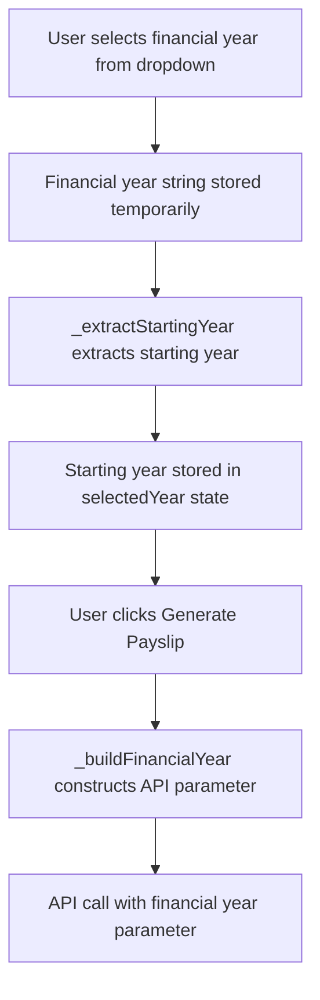

# Design Document: Payslip Financial Year Dropdown

## Overview

This design implements a UI enhancement to the payslip page's year selection dropdown. The change replaces the display of individual calendar years (e.g., "2025", "2024") with financial year pairs (e.g., "2025-2026", "2024-2025") to improve user clarity when selecting payslip periods.

The implementation is a presentation-layer change that maintains full backward compatibility with the existing API. The dropdown will display financial years, but the underlying state management and API integration will continue to use the starting year for all calculations and service calls.

### Key Design Decisions

1. **UI-Only Change**: The modification is isolated to the dropdown presentation logic. No changes to API contracts, data models, or business logic are required.

2. **String Parsing Approach**: Financial years will be stored as formatted strings (e.g., "2025-2026") in the dropdown, with extraction logic to parse the starting year when needed for API calls.

3. **Backward Compatibility**: The existing `_buildFinancialYear()` method and all API integration points remain unchanged, ensuring zero impact on backend services.

## Architecture

### Component Structure

```
PayslipPage (StatefulWidget)
├── State Management
│   ├── selectedMonth: String (unchanged)
│   ├── selectedYear: String (now stores starting year extracted from financial year)
│   └── Other state variables (unchanged)
├── UI Components
│   ├── _buildPeriodSelector() (unchanged)
│   ├── _buildDropdown() (unchanged)
│   └── Year Dropdown (modified data source)
└── Business Logic
    ├── years getter (modified to generate financial year strings)
    ├── _extractStartingYear() (new helper method)
    ├── _buildFinancialYear() (unchanged)
    └── _callPayslipApi() (unchanged)
```

### Data Flow



### Modification Points

1. **`years` getter**: Modified to generate financial year strings instead of individual years
2. **Dropdown `onChanged` callback**: Enhanced to extract starting year from selected financial year
3. **New helper method**: `_extractStartingYear()` to parse financial year strings

## Components and Interfaces

### Modified Component: `years` Getter

**Current Implementation:**
```dart
List<String> get years {
  final currentYear = DateTime.now().year;
  return List.generate(10, (index) => (currentYear - index).toString())
      .where((year) => int.parse(year) >= 2020)
      .toList();
}
```

**New Implementation:**
```dart
List<String> get years {
  final currentYear = DateTime.now().year;
  return List.generate(10, (index) {
    final startYear = currentYear - index;
    if (startYear < 2020) return null;
    return '$startYear-${startYear + 1}';
  })
  .whereType<String>()
  .toList();
}
```

**Interface Contract:**
- **Input**: None (uses current system year)
- **Output**: `List<String>` of financial year strings in format "YYYY-YYYY+1"
- **Constraints**: Only includes financial years where starting year >= 2020

### New Component: `_extractStartingYear` Method

**Purpose**: Parse financial year string to extract the starting year for API calls.

**Signature:**
```dart
String _extractStartingYear(String financialYear)
```

**Implementation:**
```dart
String _extractStartingYear(String financialYear) {
  if (financialYear.isEmpty) return '';
  final parts = financialYear.split('-');
  if (parts.isEmpty) return '';
  final startYear = int.tryParse(parts[0]);
  return startYear != null ? startYear.toString() : '';
}
```

**Interface Contract:**
- **Input**: `financialYear` - String in format "YYYY-YYYY+1" (e.g., "2025-2026")
- **Output**: String representation of starting year (e.g., "2025")
- **Error Handling**: Returns empty string for invalid formats
- **Validation**: Ensures parsed value is a valid integer

### Modified Component: Year Dropdown `onChanged` Callback

**Current Implementation:**
```dart
onChanged: (value) {
  setState(() {
    selectedYear = value ?? '';
    _payslipVisible = null;
    _companyInfo = null;
    _errorMessage = null;
    _errorStatus = null;
  });
}
```

**New Implementation:**
```dart
onChanged: (value) {
  setState(() {
    selectedYear = _extractStartingYear(value ?? '');
    _payslipVisible = null;
    _companyInfo = null;
    _errorMessage = null;
    _errorStatus = null;
  });
}
```

**Changes:**
- Extracts starting year from financial year string before storing in state
- Maintains all existing state clearing behavior

### Unchanged Components

The following components require no modification:

1. **`_buildFinancialYear()` method**: Continues to construct financial year from starting year
2. **`_callPayslipApi()` method**: Uses `selectedYear` (starting year) as before
3. **`_buildDropdown()` widget**: UI structure and styling remain identical
4. **API Service Layer**: No changes to `PayslipApiService.fetchPayslipDetails()`

## Data Models

### State Variables

| Variable | Type | Current Value Example | New Value Example | Notes |
|----------|------|----------------------|-------------------|-------|
| `selectedMonth` | `String` | "January" | "January" | Unchanged |
| `selectedYear` | `String` | "2025" | "2025" | Still stores starting year (extracted from financial year) |
| `_payslipVisible` | `Map<String, dynamic>?` | `{...}` | `{...}` | Unchanged |
| `_companyInfo` | `Map<String, dynamic>?` | `{...}` | `{...}` | Unchanged |

### Dropdown Data Model

**Current:**
```dart
List<String> years = ["2026", "2025", "2024", "2023", ...]
```

**New:**
```dart
List<String> years = ["2026-2027", "2025-2026", "2024-2025", "2023-2024", ...]
```

### API Parameter Model

**Unchanged:**
```dart
{
  "empId": "EMP123",
  "financialYear": "2025-2026",  // Still constructed by _buildFinancialYear()
  "month": "01",
  "secure": "token"
}
```

## Correctness Properties

*A property is a characteristic or behavior that should hold true across all valid executions of a system-essentially, a formal statement about what the system should do. Properties serve as the bridge between human-readable specifications and machine-verifiable correctness guarantees.*

### Property 1: Financial Year Format Consistency

*For any* year value generated by the `years` getter, the output string SHALL match the format "YYYY-YYYY+1" where the second year is exactly one greater than the first year.

**Validates: Requirements 1.1**

### Property 2: Financial Year List Bounds

*For any* execution of the `years` getter, all financial year strings in the returned list SHALL have a starting year greater than or equal to 2020, and the list SHALL contain at most 10 entries in descending chronological order.

**Validates: Requirements 1.2, 1.3, 5.1**

### Property 3: Starting Year Extraction Round Trip

*For any* valid financial year string in the format "YYYY-YYYY+1", extracting the starting year and then passing it to `_buildFinancialYear()` SHALL produce a financial year string equivalent to the original input.

**Validates: Requirements 2.1, 2.4, 3.2, 3.3**

### Property 4: State Storage After Selection

*For any* financial year string selected from the dropdown, the `selectedYear` state variable SHALL contain the extracted starting year (first four characters before the hyphen) after the `onChanged` callback completes.

**Validates: Requirements 2.3**

### Property 5: State Clearing on Selection Change

*For any* financial year selection change, the payslip page SHALL clear all previously loaded payslip data (`_payslipVisible`), company information (`_companyInfo`), error messages (`_errorMessage`), and error status (`_errorStatus`) before storing the new selection.

**Validates: Requirements 4.2, 4.3**

### Property 6: Invalid Input Handling

*For any* financial year string that does not match the format "YYYY-YYYY+1" or contains non-numeric year values, the `_extractStartingYear()` method SHALL return an empty string, and the "Generate Payslip" button SHALL remain disabled.

**Validates: Requirements 5.2, 5.4**

## Error Handling

### Input Validation Errors

**Scenario**: Invalid financial year format selected or parsed

**Handling Strategy**:
1. The `_extractStartingYear()` method returns an empty string for any invalid input
2. Empty string in `selectedYear` prevents the "Generate Payslip" button from being enabled
3. No error messages are displayed to the user since invalid formats should not be selectable from the dropdown

**Implementation**:
```dart
String _extractStartingYear(String financialYear) {
  if (financialYear.isEmpty) return '';
  final parts = financialYear.split('-');
  if (parts.isEmpty) return '';
  final startYear = int.tryParse(parts[0]);
  return startYear != null ? startYear.toString() : '';
}
```

### List Generation Errors

**Scenario**: Year calculation produces invalid values during list generation

**Handling Strategy**:
1. Use `whereType<String>()` to filter out null values from list generation
2. Ensure at least the 2020-2021 financial year is always available as a fallback
3. Invalid years (< 2020) are skipped during generation without throwing errors

**Implementation**:
```dart
List<String> get years {
  final currentYear = DateTime.now().year;
  return List.generate(10, (index) {
    final startYear = currentYear - index;
    if (startYear < 2020) return null;  // Skip invalid years
    return '$startYear-${startYear + 1}';
  })
  .whereType<String>()  // Filter out nulls
  .toList();
}
```

### State Consistency Errors

**Scenario**: User changes year selection while payslip data is loaded

**Handling Strategy**:
1. Clear all related state variables (`_payslipVisible`, `_companyInfo`, `_errorMessage`, `_errorStatus`) immediately on selection change
2. Prevent stale data from being displayed with new selection
3. Force user to regenerate payslip with new parameters

**Implementation**: Already handled in existing `onChanged` callback with state clearing logic.

### API Compatibility Errors

**Scenario**: Extracted starting year produces unexpected API parameter format

**Handling Strategy**:
1. The `_buildFinancialYear()` method remains unchanged and continues to construct the expected format
2. Unit tests verify round-trip consistency (extract → rebuild → compare)
3. Integration tests verify API receives correct parameter format

**Risk Mitigation**: Since `_buildFinancialYear()` is unchanged and only receives starting year (as before), API compatibility is guaranteed by design.

## Testing Strategy

### Dual Testing Approach

This feature requires both unit tests and property-based tests to ensure comprehensive coverage:

- **Unit Tests**: Verify specific examples, edge cases, and UI integration points
- **Property Tests**: Verify universal properties across all possible inputs

### Property-Based Testing

**Framework**: Use the `test` package with custom property test helpers or the `fast_check` Dart package for property-based testing.

**Configuration**:
- Minimum 100 iterations per property test
- Each test tagged with feature name and property reference

**Property Test Suite**:

#### Test 1: Financial Year Format Consistency
```dart
// Feature: payslip-financial-year-dropdown, Property 1: Financial Year Format Consistency
test('Property 1: All generated financial years match format YYYY-YYYY+1', () {
  for (int i = 0; i < 100; i++) {
    final randomYear = 2020 + Random().nextInt(20);
    final financialYear = '$randomYear-${randomYear + 1}';
    
    // Verify format
    expect(financialYear, matches(RegExp(r'^\d{4}-\d{4}$')));
    
    // Verify second year is first year + 1
    final parts = financialYear.split('-');
    expect(int.parse(parts[1]), equals(int.parse(parts[0]) + 1));
  }
});
```

#### Test 2: Financial Year List Bounds
```dart
// Feature: payslip-financial-year-dropdown, Property 2: Financial Year List Bounds
test('Property 2: All financial years have starting year >= 2020 and list has max 10 entries', () {
  for (int i = 0; i < 100; i++) {
    final payslipPage = _PayslipPageState();
    final yearsList = payslipPage.years;
    
    // Verify list size
    expect(yearsList.length, lessThanOrEqualTo(10));
    
    // Verify all starting years >= 2020
    for (final fy in yearsList) {
      final startYear = int.parse(fy.split('-')[0]);
      expect(startYear, greaterThanOrEqualTo(2020));
    }
    
    // Verify descending order
    for (int j = 0; j < yearsList.length - 1; j++) {
      final year1 = int.parse(yearsList[j].split('-')[0]);
      final year2 = int.parse(yearsList[j + 1].split('-')[0]);
      expect(year1, greaterThan(year2));
    }
  }
});
```

#### Test 3: Starting Year Extraction Round Trip
```dart
// Feature: payslip-financial-year-dropdown, Property 3: Starting Year Extraction Round Trip
test('Property 3: Extract then rebuild produces equivalent financial year', () {
  final payslipPage = _PayslipPageState();
  
  for (int i = 0; i < 100; i++) {
    final randomStartYear = 2020 + Random().nextInt(20);
    final originalFY = '$randomStartYear-${randomStartYear + 1}';
    
    // Extract starting year
    final extracted = payslipPage._extractStartingYear(originalFY);
    
    // Rebuild financial year
    final rebuilt = payslipPage._buildFinancialYear(extracted);
    
    // Verify equivalence
    expect(rebuilt, equals(originalFY));
  }
});
```

#### Test 4: State Storage After Selection
```dart
// Feature: payslip-financial-year-dropdown, Property 4: State Storage After Selection
testWidgets('Property 4: selectedYear contains extracted starting year after selection', (tester) async {
  for (int i = 0; i < 100; i++) {
    await tester.pumpWidget(MaterialApp(home: PayslipPage()));
    
    final randomStartYear = 2020 + Random().nextInt(10);
    final financialYear = '$randomStartYear-${randomStartYear + 1}';
    
    // Simulate selection
    final state = tester.state<_PayslipPageState>(find.byType(PayslipPage));
    state.setState(() {
      state.selectedYear = state._extractStartingYear(financialYear);
    });
    await tester.pump();
    
    // Verify state
    expect(state.selectedYear, equals(randomStartYear.toString()));
  }
});
```

#### Test 5: State Clearing on Selection Change
```dart
// Feature: payslip-financial-year-dropdown, Property 5: State Clearing on Selection Change
testWidgets('Property 5: All payslip state cleared on year selection change', (tester) async {
  for (int i = 0; i < 100; i++) {
    await tester.pumpWidget(MaterialApp(home: PayslipPage()));
    
    final state = tester.state<_PayslipPageState>(find.byType(PayslipPage));
    
    // Set up initial state with data
    state.setState(() {
      state._payslipVisible = {'test': 'data'};
      state._companyInfo = {'company': 'info'};
      state._errorMessage = 'Some error';
      state._errorStatus = 404;
    });
    await tester.pump();
    
    // Change year selection
    final newFY = '2025-2026';
    state.setState(() {
      state.selectedYear = state._extractStartingYear(newFY);
      state._payslipVisible = null;
      state._companyInfo = null;
      state._errorMessage = null;
      state._errorStatus = null;
    });
    await tester.pump();
    
    // Verify all cleared
    expect(state._payslipVisible, isNull);
    expect(state._companyInfo, isNull);
    expect(state._errorMessage, isNull);
    expect(state._errorStatus, isNull);
  }
});
```

#### Test 6: Invalid Input Handling
```dart
// Feature: payslip-financial-year-dropdown, Property 6: Invalid Input Handling
test('Property 6: Invalid formats return empty string and disable button', () {
  final payslipPage = _PayslipPageState();
  final invalidInputs = [
    '',
    'invalid',
    '2025',
    '2025-',
    '-2026',
    '2025-202a',
    'abcd-efgh',
    '2025/2026',
    '2025 2026',
  ];
  
  for (int i = 0; i < 100; i++) {
    final randomInvalid = invalidInputs[Random().nextInt(invalidInputs.length)];
    
    // Extract starting year
    final extracted = payslipPage._extractStartingYear(randomInvalid);
    
    // Verify empty string returned
    expect(extracted, equals(''));
    
    // Verify button would be disabled
    payslipPage.selectedYear = extracted;
    payslipPage.selectedMonth = 'January';
    expect(payslipPage.canGeneratePayslip, isFalse);
  }
});
```

### Unit Testing

**Framework**: Flutter's built-in `test` and `flutter_test` packages

**Focus Areas**:
1. Specific example cases from requirements
2. Edge cases for year boundaries
3. UI widget integration
4. State management verification

**Unit Test Suite**:

#### Example Test: Specific Year 2026
```dart
test('Example: Year 2026 generates correct financial year list', () {
  // Mock current year as 2026
  final payslipPage = _PayslipPageState();
  // Assuming we can inject or mock DateTime.now()
  
  final expected = [
    '2026-2027', '2025-2026', '2024-2025', '2023-2024',
    '2022-2023', '2021-2022', '2020-2021'
  ];
  
  expect(payslipPage.years, equals(expected));
});
```

#### Example Test: Specific Extraction Case
```dart
test('Example: Extract "2025" from "2025-2026"', () {
  final payslipPage = _PayslipPageState();
  final result = payslipPage._extractStartingYear('2025-2026');
  expect(result, equals('2025'));
});
```

#### Edge Case Test: Boundary Year 2020
```dart
test('Edge Case: Year 2020 is included in list', () {
  final payslipPage = _PayslipPageState();
  final yearsList = payslipPage.years;
  
  final has2020 = yearsList.any((fy) => fy.startsWith('2020-'));
  expect(has2020, isTrue);
});
```

#### Edge Case Test: Year 2019 Excluded
```dart
test('Edge Case: Year 2019 is excluded from list', () {
  final payslipPage = _PayslipPageState();
  final yearsList = payslipPage.years;
  
  final has2019 = yearsList.any((fy) => fy.startsWith('2019-'));
  expect(has2019, isFalse);
});
```

#### UI Integration Test: Hint Text Display
```dart
testWidgets('UI: Dropdown shows "Select Year" hint when no selection', (tester) async {
  await tester.pumpWidget(MaterialApp(home: PayslipPage()));
  
  expect(find.text('Select Year'), findsOneWidget);
});
```

#### UI Integration Test: Dropdown Items Display
```dart
testWidgets('UI: Dropdown displays financial year options', (tester) async {
  await tester.pumpWidget(MaterialApp(home: PayslipPage()));
  
  // Open dropdown
  await tester.tap(find.byType(DropdownButton<String>).last);
  await tester.pumpAndSettle();
  
  // Verify financial year format in dropdown items
  expect(find.textContaining('-'), findsWidgets);
});
```

### Integration Testing

**Focus**: Verify end-to-end flow from dropdown selection to API call

```dart
testWidgets('Integration: Financial year selection triggers correct API call', (tester) async {
  // Mock API service
  final mockApiService = MockPayslipApiService();
  
  await tester.pumpWidget(MaterialApp(home: PayslipPage()));
  
  final state = tester.state<_PayslipPageState>(find.byType(PayslipPage));
  
  // Select month and year
  state.setState(() {
    state.selectedMonth = 'January';
    state.selectedYear = state._extractStartingYear('2025-2026');
  });
  await tester.pump();
  
  // Tap generate button
  await tester.tap(find.text('Generate Payslip'));
  await tester.pump();
  
  // Verify API called with correct financial year
  verify(mockApiService.fetchPayslipDetails(
    empId: any,
    financialYear: '2025-2026',
    month: '01',
    secure: any,
  )).called(1);
});
```

### Test Coverage Goals

- **Line Coverage**: > 95% for modified code
- **Branch Coverage**: 100% for error handling paths
- **Property Coverage**: All 6 correctness properties tested with 100+ iterations each
- **Example Coverage**: All specific examples from requirements tested

